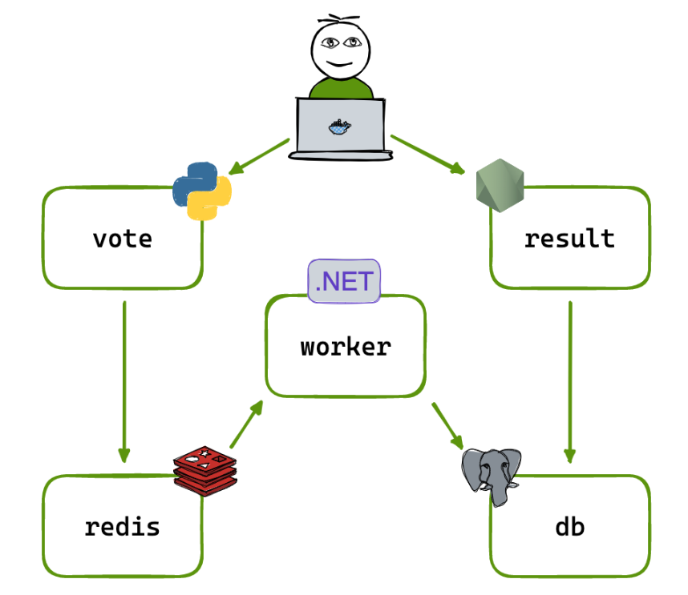

# Application Architecture (Microservices)

This project demonstrates a distributed, containerized microservices application deployed across multiple instances. The architecture is intentionally **polyglot**, designed to showcase how different technologies can work together in a real-world DevOps environment rather than representing a perfect or optimized design.

## Architecture Overview

The application allows users to vote for their favorite pet (cats or dogs) and view real-time results. It is composed of user-facing services and internal backend services, each running as an independent Docker container.

User-facing services:

- **Vote** – Accepts user votes
- **Result** – Displays aggregated voting results

Internal services:

- **Redis** – Temporary vote storage and queue
- **Worker** – Background vote processor
- **PostgreSQL** – Persistent data store

## Microservices Breakdown

**Vote Service (Python / Flask)**
Provides a web interface for users to cast votes. Votes are written to Redis for fast, in-memory processing. This service exposes an HTTP endpoint and is accessible to end users.

**Redis**
Acts as an in-memory data store and message queue between the Vote and Worker services. Redis enables high-throughput vote ingestion and decouples frontend traffic from backend processing.

**Worker Service (.NET / C#)**
Consumes votes from Redis and persists them into PostgreSQL. This background service depends on both Redis and PostgreSQL to function correctly.

**Result Service (Node.js)**
Reads vote data from PostgreSQL and displays results in real time. It serves a web interface and uses WebSockets to update results dynamically.

**PostgreSQL**
Stores persistent voting data used by the Result service for aggregation and display.

## Service Connectivity

The services communicate through a defined set of connections:

- Vote → Redis
- Worker → Redis
- Worker → PostgreSQL
- Result → PostgreSQL

Each container relies on environment variables to define service endpoints. When deployed across multiple instances, services may communicate via private networking or public IPs, depending on port exposure and network configuration.

This architecture highlights core microservices principles such as separation of concerns, asynchronous processing, and container-based deployment within a cloud infrastructure.
