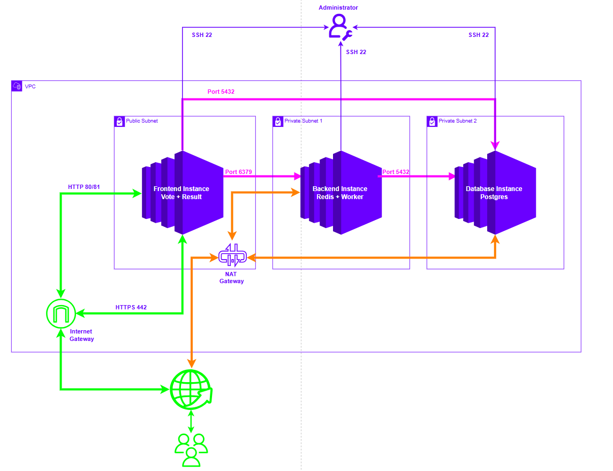

# Architecture Design

## Network Infrastructure

The application is deployed within an AWS VPC (Virtual Private Cloud) consisting of three subnets for secure service isolation:

- **Public Subnet** : Hosts the Frontend Instance (Vote + Result applications). Directly accessible from the internet via Internet Gateway on ports 80/443.
- **Private Subnet 1** : Hosts the Backend Instance (Redis + Worker service). Accessible only from within the VPC and outbound internet access via NAT Gateway.
- **Private Subnet 2** : Hosts the Database Instance (PostgreSQL). Isolated within the VPC with no direct internet access.

## Internet & SSH Access

- **Internet Gateway** : Provides inbound/outbound internet connectivity for the public subnet on ports 80/443 (HTTP/HTTPS).
- **NAT Gateway** : Enables outbound internet access from private subnets while blocking inbound traffic from the internet.
- **SSH Port 22** : Accessible only to the Administrator for managing instances across all subnets.

## Inter-Service Communication

- **Frontend to Backend** : Port 6379 (Redis) and port 5432 (PostgreSQL) communication for vote processing and result retrieval.
- **Backend to Database** : Port 5432 for worker service to persist votes into PostgreSQL.
- **Public Access** : Vote and Result applications exposed on ports 80/443 for end-users.

## Security Model

Services follow a defense-in-depth approach with public-facing Vote and Result applications isolated from internal processing services (Redis, Worker) and persistent storage (PostgreSQL). All backend communication is restricted to private subnets, ensuring sensitive operations remain protected from external access.
