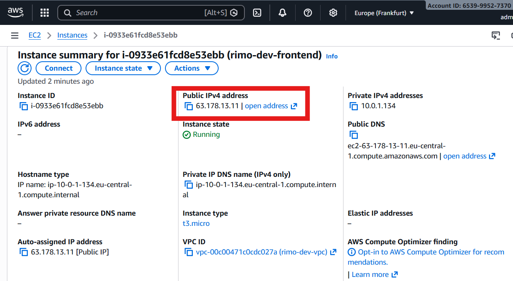
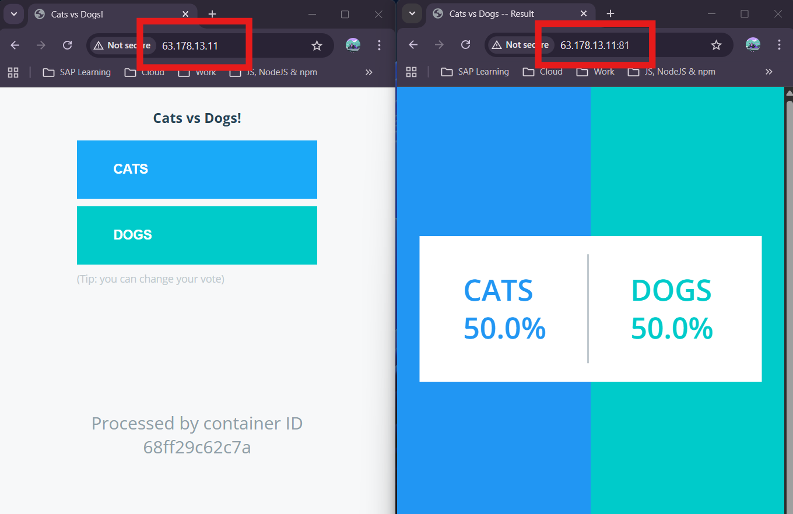

# Testing the Application

This section verifies that all microservices (vote, result, redis, postgres) are working correctly after deployment.

## 1. Accessing the Frontend (Vote + Result)

- The **frontend EC2 instance** exposes both applications to the internet.
- Open the public URL in your browser:
  - **Vote App** → Users can cast a vote
  - **Result App** → Displays live results

Both should load without errors.

## 2. Verifying End-to-End Flow

- Cast multiple votes from the Voting page.
- Check the Results page — votes should update immediately.
- This confirms:
  - **Redis** is receiving and forwarding votes
  - **Worker** processes votes correctly
  - **PostgreSQL** stores the records
  - **Result App** reads data back from the database

## 3. Expected Working Behaviour (Based on Screenshots)

- Voting page loads and accepts input.
- Results page updates as soon as votes are cast.
- No 500 or connection errors.
- Vote counts persist and reflect correctly after refresh.

