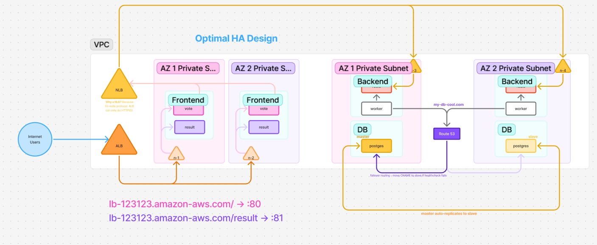
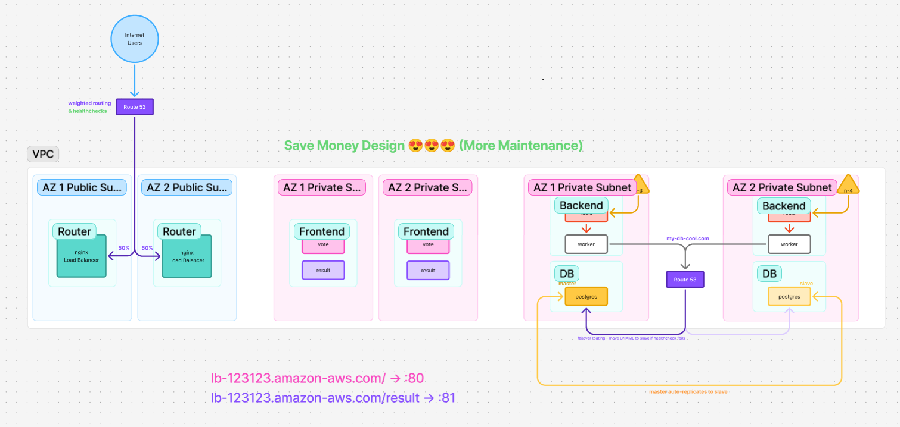

# Add-ons & Improvements

This section highlights two improved architecture designs suggested by the trainer. These designs go beyond the basic 3-instance setup and focus on **high availability**, **better accessibility**, and **cost optimisation** while still keeping the core microservices structure unchanged.

---

## 1. Optimal High Availability (HA) Design

This design improves reliability and scalability by distributing workloads across multiple Availability Zones.

### Key Ideas

- **Frontend replicated across AZ1 & AZ2**, ensuring the app stays online even if one AZ fails.
- **ALB** handles HTTP traffic for `/vote` and `/result` pages.
- **NLB** handles TCP traffic where needed (e.g., worker/Redis).
- **Backend tier** (worker + Redis) deployed in both AZs.
- **Database tier** uses **master–replica** Postgres setup:
  - Master in AZ1
  - Replica in AZ2
- **Route 53 failover**:
  - If the master DB fails, DNS shifts traffic to the replica.

### Benefits

- High availability across multiple AZs
- Automatic failover for database
- Scalable frontend and backend
- Better fault tolerance end to end

---

## 2. Cost-Optimized “Save Money” Design

This design reduces AWS cost while still providing multi-AZ redundancy.

### Key Ideas

- No ALB/NLB — instead use **NGINX load balancers** (Routers) running on EC2 in public subnets across AZ1 & AZ2.
- **Route 53 weighted routing** splits traffic 50/50 between the two routers.
- Frontend still runs in private subnets in multiple AZs.
- Backend and DB layers remain similar to HA design, including master–replica Postgres setup.

### Benefits

- Cheaper than using AWS-managed load balancers
- Multi-AZ resiliency maintained
- Custom NGINX layer gives flexibility in routing rules
- Infrastructure still logically separated into frontend, backend, database tiers
